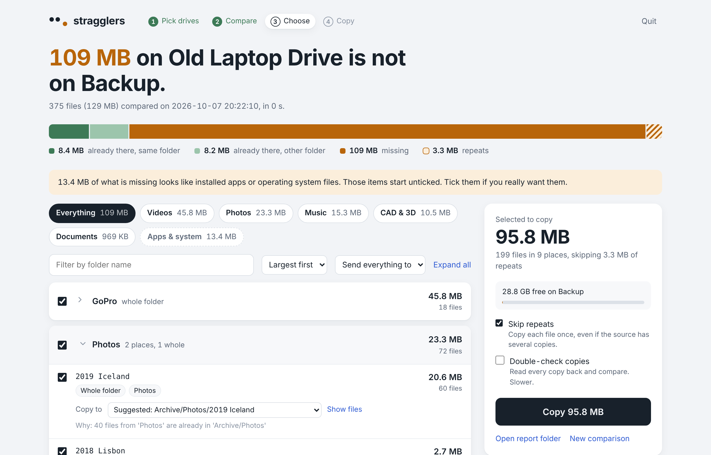
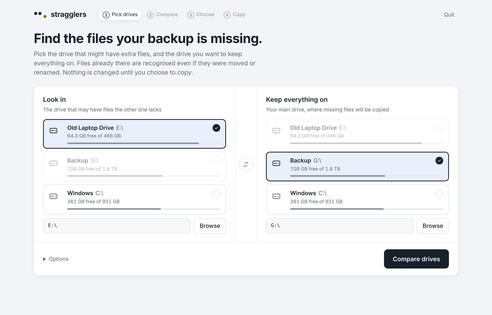

# stragglers

**Find the files on one drive that your backup is missing, and copy them over.**

You have an old drive and a newer one that is supposed to hold everything. Some
folders were copied across years ago, some were renamed, some were moved into
"Unsorted" or "Old stuff". Comparing folder by folder doesn't work, because the
same photo can live under a completely different path on each drive.

stragglers compares the drives by what the files are, not where they are. It
shows you what is genuinely missing, one line per folder, and copies what you
pick without ever overwriting or deleting anything.



- **Recognises moved and renamed files.** A file counts as already there if
  the same content exists anywhere on the backup, under any name.
- **Fast on big drives.** Most files are matched by size and date without being
  read. Only the uncertain ones are opened, and many at once.
- **Readable results.** A whole missing folder is one line, not 5,000.
  Everything is grouped by top folder and by type (videos, photos, documents
  and so on).
- **Suggests where things go.** If your backup keeps `Photos` inside
  `Archive`, missing photo folders are suggested for `Archive/Photos` too. You
  can change any destination.
- **Skips the junk.** Folders that look like installed apps or Windows system
  files are flagged and left unticked. Repeats inside the source are copied once.
- **Safe copying.** Nothing on either drive is overwritten or deleted. A name
  clash gets `(from <source name>)` added. Interrupted copies leave no
  half-written files, and running it again picks up where it stopped.
- **Private.** Runs entirely on your computer. The browser page is served only
  to your own machine, and nothing is uploaded anywhere.
- **No dependencies.** Plain Python 3.9 or newer, standard library only.
  Works on **Windows, macOS and Linux**.

## Get started

You need Python 3.9 or newer.

| | Install Python |
|---|---|
| **Windows** | Install **Python Install Manager** from the Microsoft Store, or the installer from [python.org](https://www.python.org/downloads/). |
| **macOS** | Install from [python.org](https://www.python.org/downloads/macos/), or `brew install python` if you use Homebrew. |
| **Linux** | Already installed on most distributions. |

### Option 1: no installation

1. On this page click **Code > Download ZIP** and unzip it anywhere.
2. Open a terminal in the unzipped folder.
   - Windows: open the folder in File Explorer, click the address bar, type `cmd` and press Enter.
   - macOS: right-click the folder in Finder and choose **New Terminal at Folder**.
3. Run it:

   ```
   python -m stragglers      # Windows
   python3 -m stragglers     # macOS and Linux
   ```

### Option 2: install the `stragglers` command

With [pipx](https://pipx.pypa.io/):

```
pipx install https://github.com/rohanbaba/stragglers/archive/refs/heads/main.zip
stragglers
```

Or with pip, inside a virtual environment:

```
python -m pip install https://github.com/rohanbaba/stragglers/archive/refs/heads/main.zip
stragglers
```

## Using it

Running `stragglers` opens a page in your browser.



1. **Pick drives.** On the left, the drive that may have extra files. On the
   right, the drive you want to keep everything on. You can also type or
   browse to a folder instead of a whole drive.
2. **Compare.** The first comparison of large drives can take a while, an hour
   or more for half a terabyte on USB hard drives. What it learns is saved, so
   later comparisons of the same drives are much faster.
3. **Choose.** Tick what you want. Filter by type, search by folder name, and
   open any item to see its files or change where it will be copied.
4. **Copy.** Confirm, and watch it copy. Afterwards, **Compare again to
   confirm** checks that nothing is left.

To stop the app, click **Quit** in the page, or press `Ctrl+C` in the terminal.

### Consolidating several drives

Compare and copy one drive at a time into your main drive. Do the next drive
only after the previous copy is finished. That way anything the old drives
share is only copied once.

## How matching works

For every file on the source, cheapest test first:

1. **Size.** If nothing on the backup has exactly that size, the file is missing. Nothing is read.
2. **Size and date modified.** Same size and same modified time means the same
   file, under any name. This is the rule rsync and robocopy use. Nothing is
   read. Clocks that shifted by whole hours, which FAT and exFAT drives do
   around time zones and daylight saving, count as a match for files with the
   same name.
3. **Content.** What is left is fingerprinted: first the first and last 64 KB,
   then the whole file (BLAKE2b) only when that matches.

**Fast mode** (the default) compares small files by content only against
same-size files that share the name or the date. The only mistake this can
make is reporting a small file that was both renamed and re-dated as missing,
so at worst it gets copied twice. It never hides a file that is really missing.
**Thorough check**, under Options, removes even that case, but on a backup with
millions of files it can take hours.

Hashes are cached by drive serial number, so a drive that comes back with a
different letter is still recognised.

## Notes for macOS

- **NTFS drives are read-only on a Mac.** stragglers can compare them, but it
  cannot copy *onto* an NTFS drive. The app tells you if the destination is
  read-only. Drives formatted as exFAT or APFS work both ways.
- The first time you compare an external drive, macOS may ask whether Terminal
  can access files on a removable volume. Click **Allow**.
- Your startup disk is listed as **Home folder**. External drives appear by name.
- File names with accents are compared correctly even when a drive was written
  by Windows and read on a Mac.

## Where results are kept

Each comparison gets its own folder with:

| File | What it is |
|---|---|
| `summary.md` | The readable report, grouped by folder and by type |
| `missing_files.csv` | Every missing file and its suggested destination. Opens in Excel or Numbers |
| `copy_log.csv` | Every file copied, where it went, and anything skipped |
| `errors.log` | Files that could not be read or copied |

The folder lives in:

- Windows: `%LOCALAPPDATA%\stragglers\scans`
- macOS: `~/Library/Application Support/stragglers/scans`
- Linux: `~/.local/share/stragglers/scans`

**Open report folder** in the app takes you straight there. Use `--data-dir`
to keep them somewhere else.

## Command line

Give a source and a destination to run in the terminal instead of the browser:

```
stragglers --source E:\ --target G:\ --report-only     # compare and write the report
stragglers --source E:\ --target G:\                   # compare, then choose and copy
stragglers --copy-plan <scan folder>/plan.json         # copy from an earlier comparison
```

macOS example: `stragglers -s "/Volumes/Old Drive" -t /Volumes/Backup --report-only`

| Option | What it does |
|---|---|
| `--label NAME` | Name for the source, used in reports and new folder names |
| `--thorough` | Also catch small files that were both renamed and re-dated (slow) |
| `--verify` | Read every copy back and compare it with the original |
| `--include-system` | In the terminal, also offer items that look like apps or system files |
| `--include-hidden` | Also scan Recycle Bin, `Thumbs.db`, `.DS_Store` and similar |
| `--data-dir DIR` | Keep scans and the hash cache in `DIR` |
| `--port N` / `--no-browser` | Browser app port, and whether to open it automatically |

## Safety

- The source drive is only ever read.
- Nothing on the destination is overwritten or deleted. A file is written under
  a temporary name and renamed only when complete.
- If a drive disconnects or fills up, copying stops cleanly and tells you why.
  Run it again and finished files are recognised and skipped.
- The browser page is served on `127.0.0.1` only, and every request needs a
  random token that is printed in your terminal.

## Development

```
python -m unittest discover -s tests -v
```

Tests build small throwaway drives in a temporary folder. They run on Windows,
macOS and Linux on every push.

## License

[MIT](LICENSE)
